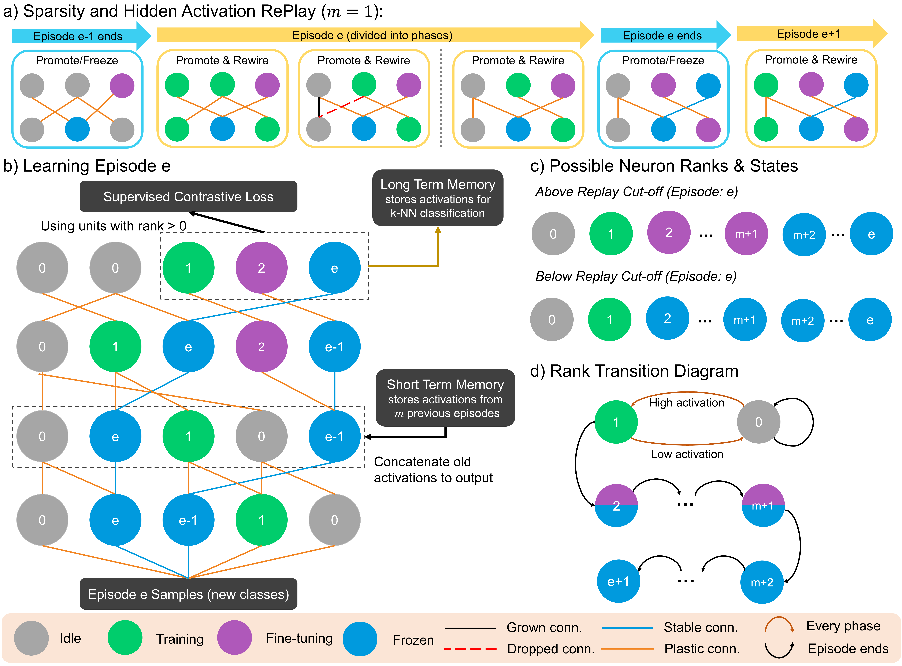

# SHARP-Continual-Learning

**Abstract:** *The goal of  continual learning (CL)  is to learn different tasks over time.The main desiderata associated with CL are to maintain performance on older tasks, leverage the latter to improve learning of future tasks, and to introduce minimal overhead in the training process (for instance, to not require a growing model or retraining). We propose the Neuro-Inspired Stability-Plasticity Adaptation (NISPA) architecture that addresses these desiderata through a sparse neural network with fixed density. NISPA forms stable paths to preserve learned knowledge from older tasks. Also, NISPA uses connection rewiring to create new plastic paths that reuse existing knowledge on novel tasks. Our extensive evaluation on EMNIST, FashionMNIST, CIFAR10, and CIFAR100 datasets shows that NISPA significantly outperforms representative state-of-the-art continual learning baselines, and it uses up to ten times fewer learnable parameters compared to baselines. We also make the case that sparsity is an essential ingredient for continual learning.*

## Paper
